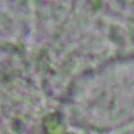
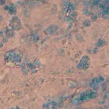
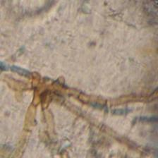
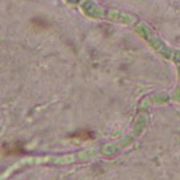

# Microscobic Fungal Classification

In this project, we used the Defungi dataset, which contains 5 classes and 9,114 images. Due to class imbalance, we applied data augmentation (random flips/rotations, zoom, color jitter) with higher probability/intensity for minority classes to improve generalization.
Below are sample images from the dataset.

### Samples From Dataset
<table>
  <tr>
    <td> <em>TSH</em></td>
    <td> <em>SHC</em></td>
    <td> <em>GMA</em></td>
  </tr>
  <tr>
    <td> <em>BBH</em></td>
    <td> <em>BASH</em></td>
  </tr>
</table>

## Models Used
- ResNet50 — residual network baseline
- Inception v3 — multi-branch convolutional model
- VGG16 — classic CNN baseline

We evaluate using accuracy and macro-averaged F1, along with per-class precision and recall. We also include a normalized confusion matrix to visualize class-wise errors and the impact of class imbalance.

